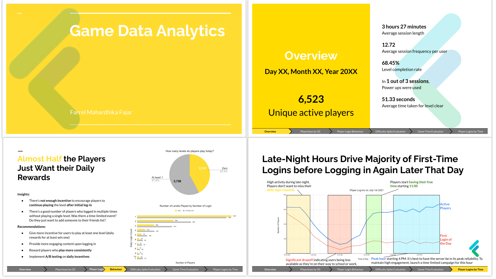
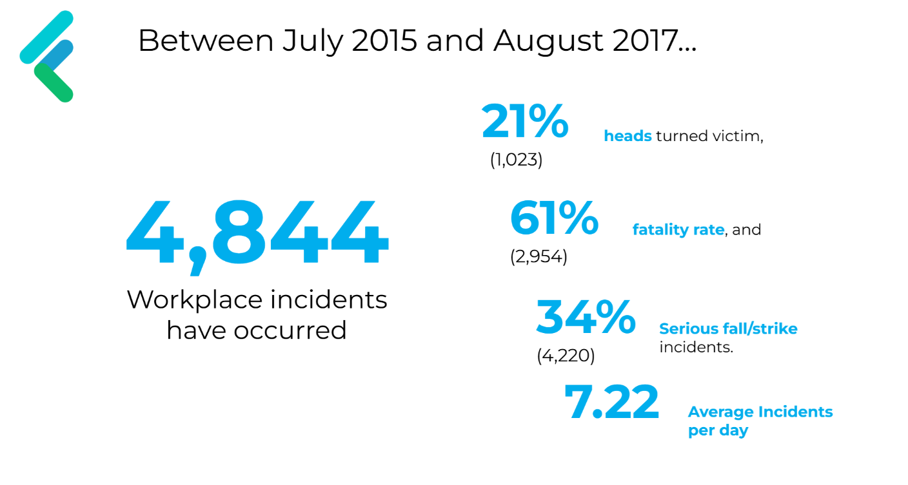

# Farrel Fajar | Data Analyst Portfolio

🔗 **LinkedIn**: [Connect with me](https://www.linkedin.com/in/farrel-fajar)  
📧 **Email**: [farrel.m.fajar@gmail.com](farrel.m.fajar@gmail.com)  
💻 **GitHub**: [View Projects](https://github.com/FarrelMFajar)  

---

## 📌 Profile  
I am a **data-driven strategist** with a background in Biomedical & Electrical Engineering and expertise in **Excel, Power BI, SQL, and Python**. My passion lies in transforming raw data into actionable insights to drive operational efficiency and strategic decisions.  
- **Key Skills**: Stakeholder engagement, KPI reporting, data storytelling, and technical documentation.  
- **Business Impact**: Reduced project delays by **25%** and operational costs by **40%** through data-driven resource optimization.  

---

## 💼 Professional Experience  

### **Technical & Design Management - Project Data Analyst**  
**Kereta Cepat Indonesia China** | Jakarta | 2020 – Present  
- **Business Intelligence**: Analyzed commercial data (funding, procurement, labor costs) for a $6B high-speed rail project, collaborating with 20+ cross-functional teams.  
- **Strategic Reporting**: Built weekly Power BI dashboards to simplify technical data for executives, accelerating decision-making by **30%**.  
- **Process Optimization**: Identified revenue growth opportunities by optimizing resource allocation, reducing project delays by **25%**.  
- **Employee Analytics**: Created an interactive punctuality dashboard (Power BI/Excel) to track KPIs like peak absenteeism, highlighting top **20%** performers driving **50%** productivity.  

### **QA & QC Data Officer**  
**Wijaya Karya Rekayasa Konstruksi** | Jakarta | 2020  
- **Database Management**: Developed a linguistic database of 400+ engineering terms, improving translation accuracy.  
- **Efficiency Gains**: Implemented a Google Sheets search feature using `QUERY()` and `VLOOKUP()` functions, boosting document retrieval speed by **60%**.  

---
## 🚀 Projects  

### 1. Daily Game Analytics  
**About**: This report provides a comprehensive analysis of player behavior in an undisclosed mobile game, identifying player retention, session length, and daily player patterns.
**Tools**: SQL, Google Sheets, Google Slides
**Business Question**: *How can player behavior and game mechanics be optimized to improve retention and monetization?*  

**[Read the Report →](https://docs.google.com/presentation/d/e/2PACX-1vT461tTEEk4SbjUZKrIXnpCsTqfjlsU6NuRkpZcQ4PBQBPJpPteckU5fzRmKF8GldH7pGDr_mGJCjBX/pub?start=true&loop=false&delayms=10000)**  

---

### **2. Employee Presence Analytics**  
**About**: This Power BI dashboard provides a comprehensive analysis of employee presence insights, helping management monitor work attendance, work-from-office (WFO) and work-from-home (WFH) trends, sick leave patterns, and annual leave usage.
**Tools**: Excel, Power BI  
**Business Question**: *Do public holidays influence employee leave requests?*  

---

### **3. Workplace Incident Analysis**  
**About**: This report analyzes workplace incidents based on the OSHA accident and injury dataset (2015-2017). It includes trends, injury severity, affected body parts, and suggested safety measures.
**Tools**: SQL, Excel  
**Business Question**: *Which body parts are most frequently injured in workplace incidents, and how can safety measures be improved based on injury data?*  

**[Read the Report →](https://github.com/FarrelMFajar/Projects/blob/dc99445cdf42b87e68c23b18217305fb69ef6784/%5BSQL%5D%20%5BMS%20Excel%5D%20Workplace%20Incident%20Analysis/Workplace%20Incident%20Analysis%20Report.pdf)**  

---

### **4. Bus Ridership Segmentation**  
**About**: The customer segmentation project focuses on analyzing student passengers' travel behavior by segmenting them based on average spending and travel frequency, helping decision makers in proposing optimized school bus routes in the advocation of free school bus program.
**Tools**: Python, Tableau  
**Business Question**: *How can student travel patterns inform route optimization?*  

**[Explore the Tableau live report →](https://github.com/FarrelMFajar/Projects/blob/dc99445cdf42b87e68c23b18217305fb69ef6784/%5BSQL%5D%20%5BMS%20Excel%5D%20Workplace%20Incident%20Analysis/Workplace%20Incident%20Analysis%20Report.pdf)**
---

### **5. COVID-19 Cases Dashboard**  
**Tools**: Power BI  
**About**: This dashboard displays COVID-19 cases in Jakarta based on open-access data, identifying trends in hospitalizations, and case-to-fatality rate within one year timeframe

**[Explore Live Dashboard →](https://github.com/FarrelMFajar/Projects/blob/a1972032b460905fe523e7ba5f1670b0041c339d/%5BSQL%5D%20Covid-19%20Data%20Exploration/COVID%20Dashboard.pbix)**  

---

## 🎓 Education & Certifications  
- **IELTS Band 8** (IDP, 2023)  
- **Meta Data Analyst Professional Certificate** (2023)  
- **M.Sc. Strategic Management** | University of Indonesia (2024–2026)  
- **M.Sc. Biomedical Engineering** | University of Indonesia | GPA: 3.90 (2020–2023)  

---

## 💻 Technical Skills  
**Tools**:  
`Excel` `Power BI` `SQL` `Python` `Tableau` `Google Sheets`  

**Domains**:  
- Data Visualization & Storytelling  
- KPI Reporting & Stakeholder Management  
- Process Optimization & Cost Analysis
- Strategic planning and management

---
